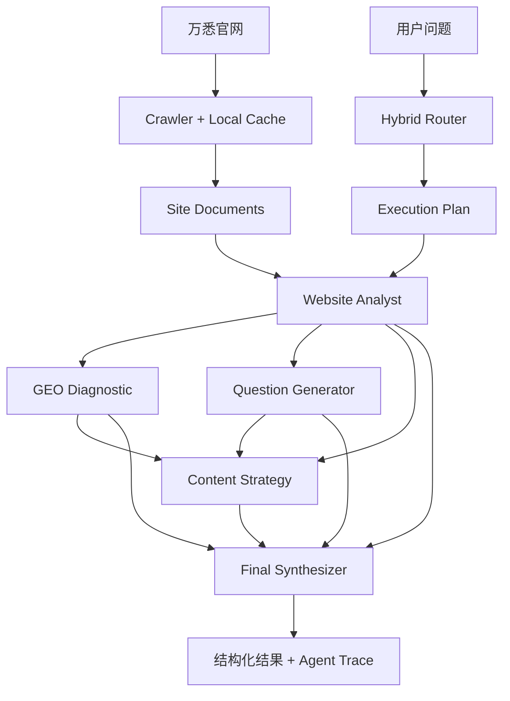

# WANXI Multi-Agent GEO Studio

> 万悉科技 AI 高级工程师笔试 Project 2：基于万悉官网的 GEO 智能体协作系统。

这是一个**可本地部署**的 GEO（Generative Engine Optimization）网站分析 Demo。系统读取万悉科技官网内容，根据用户问题通过 Router 自动选择 Agent，并展示 Agent 调用链、中间结果和最终结构化建议。

## 核心能力

- 官网采集与本地缓存：BeautifulSoup + requests，限制同域页面，避免每次重复抓取。
- Hybrid Router：优先使用确定性规则；模糊问题再使用 LLM Router。
- 4 个职责清晰的 Agent：
  - Website Analyst：提取品牌定位、产品能力、技术关键词、服务对象、核心表达。
  - GEO Diagnostic：判断内容是否便于 AI 理解、抽取和引用。
  - Question Generator：模拟目标客户可能向 ChatGPT / DeepSeek / Gemini / Perplexity 提问的问题。
  - Content Strategy：根据前序结果给出 FAQ / Blog / 案例页 / 产品页建议与优先级。
- 真正的多 Agent 依赖：下游 Agent 消费上游结构化结果，而不是固定把多个 Prompt 全跑一遍。
- 可解释执行：返回 Router 决策、调用 Agent 列表、每个 Agent 中间结果和最终整合结果。
- 两种入口：Streamlit Web Demo + CLI。
- 两种模型部署方式：
  - **Ollama（默认）**：模型完全运行在本机。
  - **DeepSeek / OpenAI-compatible API**：程序本地运行，模型通过 API 调用。

## 架构



Router 不只是返回 Agent 名称，还会生成有依赖关系的执行计划。例如：

```text
用户：请分析官网哪些内容适合被 AI 引用，并给出内容优化建议。

website_analyst
      ↓
geo_diagnostic
      ↓
content_strategy
      ↓
final_synthesizer
```

## 本地安装

推荐 Python 3.11 或 3.12。

### 1. 克隆仓库

```bash
git clone https://github.com/chromiii/WANXI-multiagent.git
cd WANXI-multiagent
```

### 2. 创建虚拟环境

Windows PowerShell：

```powershell
py -3.11 -m venv .venv
.\.venv\Scripts\Activate.ps1
python -m pip install --upgrade pip
pip install -e .
```

macOS / Linux：

```bash
python3 -m venv .venv
source .venv/bin/activate
python -m pip install --upgrade pip
pip install -e .
```

也可以使用：

```bash
pip install -r requirements.txt
```

### 3A. 完全本地：Ollama

安装 Ollama 后拉取一个中文能力较好的模型，例如：

```bash
ollama pull qwen2.5:7b
```

确保 Ollama 已启动，然后：

```bash
cp .env.example .env
```

Windows 可执行：

```powershell
Copy-Item .env.example .env
```

默认配置已经指向：

```env
LLM_PROVIDER=ollama
LLM_BASE_URL=http://localhost:11434/v1
LLM_MODEL=qwen2.5:7b
LLM_API_KEY=ollama
```

机器配置较低时，可以换成更小的 Ollama 模型；如果更关注输出质量，也可以换成更大的模型。

### 3B. 使用 DeepSeek API

编辑 `.env`：

```env
LLM_PROVIDER=deepseek
LLM_BASE_URL=https://api.deepseek.com/v1
LLM_MODEL=deepseek-chat
LLM_API_KEY=你的_API_Key
```

**不要把真实 Key 提交到 GitHub。** `.env` 已加入 `.gitignore`。

## 运行 Web Demo

```bash
streamlit run app.py
```

浏览器打开 Streamlit 输出的本地地址，默认通常为：

```text
http://localhost:8501
```

第一次分析会抓取官网并写入 `.cache/site_docs.json`；后续默认复用缓存。需要重新抓取时勾选页面中的“强制刷新官网缓存”。

## 运行 CLI

安装为 editable package 后：

```bash
wanxi-geo "万悉科技官网目前表达了什么？"
```

或者：

```bash
python -m wanxi_geo.cli "请分析万悉科技官网目前哪些内容适合被 AI 引用，并给出 GEO 优化建议。"
```

强制重新抓取：

```bash
wanxi-geo "请生成目标客户可能向 AI 提出的问题" --refresh
```

## 推荐 Demo Case

### Case 1：单 Agent

```text
万悉科技官网目前表达了什么？
```

预期主链路：

```text
Website Analyst
```

### Case 2：双 Agent

```text
请基于万悉官网内容，生成一组目标客户可能向 AI 提出的问题。
```

预期主链路：

```text
Website Analyst -> Question Generator
```

### Case 3：多 Agent 协作

```text
请分析万悉科技官网目前哪些内容适合被 AI 引用，哪些内容还需要优化，并基于目标客户问题提出内容策略。
```

预期主链路：

```text
Website Analyst
   ├─> GEO Diagnostic
   └─> Question Generator
          ↓
     Content Strategy
          ↓
      Synthesizer
```

## Router 设计

明确问题优先走规则路由，减少额外模型调用和不确定性。例如：

- “官网表达了什么 / 品牌定位 / 产品能力” -> Website Analyst
- “哪里需要优化 / 是否适合 AI 引用 / GEO 诊断” -> GEO Diagnostic
- “用户会怎么问 AI / 目标客户问题” -> Question Generator
- “应该写什么 / FAQ / Blog / 案例 / 内容策略” -> Content Strategy

当规则没有足够信号时，再调用 LLM Router。Router 返回的不只是 Agent 列表，而是带依赖关系的 Execution Plan；Orchestrator 会自动补齐必要的上游 Agent。

## 幻觉控制与证据设计

1. 网站事实只能来自抓取到的 SITE_CONTEXT。
2. Prompt 明确区分“Observed Fact”和“Recommendation”。
3. 网站事实要求附带 `source_url` 和 `evidence`。
4. 证据不足时输出 `insufficient_evidence`，而不是补全事实。
5. 内容策略可以提出新的内容创意，但必须标记为“建议”，不能把建议写成公司现状。
6. Agent 之间传递结构化 JSON，减少自然语言链式传播造成的事实漂移。

## 项目目录

```text
.
├── app.py
├── pyproject.toml
├── requirements.txt
├── .env.example
├── src/
│   └── wanxi_geo/
│       ├── agents/
│       ├── prompts/
│       ├── config.py
│       ├── context.py
│       ├── crawler.py
│       ├── llm.py
│       ├── models.py
│       ├── orchestrator.py
│       ├── router.py
│       └── cli.py
├── tests/
└── examples/
```

## 测试

```bash
pytest -q
```

重点测试 Router：同一个系统必须能对不同问题选择不同 Agent，并自动补齐依赖，而不是固定执行全部 Agent。

## 当前方案不足与后续优化

这是 3 天笔试场景下的轻量 Demo，并非生产级爬虫或 GEO 评测平台。当前主要限制：

- 对强 JavaScript 渲染页面只做基础 HTML 抓取；生产环境可增加 Playwright fallback。
- 当前站点检索采用轻量 lexical ranking；网站规模扩大后可接 Elasticsearch / Qdrant / Milvus。
- GEO 诊断是基于可解释 rubric 的 LLM 评估，并不等价于真实搜索引擎或大模型平台的线上曝光数据。
- 尚未接入真实 ChatGPT / Gemini / Perplexity 查询结果做 citation monitoring。
- 连续追问目前保留 UI 会话记录，但没有做长期用户记忆；生产环境应增加 session state / checkpoint store。
- 可进一步加入并行 Agent、LangGraph 状态图、异步抓取、评测集和 tracing。

## 设计取舍

本项目没有为了“多 Agent”强行引入 CrewAI/AutoGen。核心调度逻辑使用普通 Python 显式实现，使 Router 选择、依赖关系、Agent 输入输出和失败路径都可以直接检查，更符合笔试对“真正理解 Agent 调度”的考察目标。
