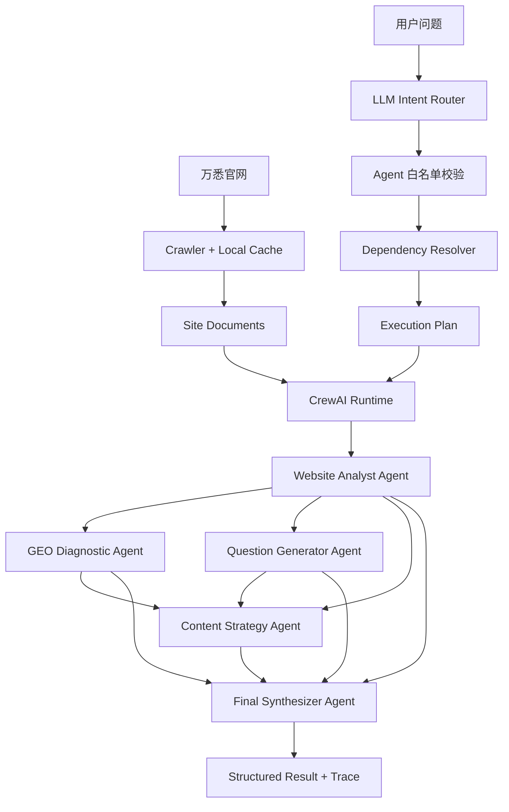

# WANXI Multi-Agent GEO Studio

> 万悉科技 AI 高级工程师笔试 Project 2：基于万悉官网的 GEO 智能体协作系统。

这是一个可本地部署的 **CrewAI Multi-Agent GEO Demo**。系统读取万悉科技官网内容，由 **LLM-first Intent Router** 做语义任务识别，代码完成 Agent 白名单校验与依赖解析，再动态创建 CrewAI Agents / Tasks / Crew；最终由 **Stage-aware Final Prompt Builder** 根据实际执行阶段约束报告结构。

## 快速入口

- [Web Demo 部署说明](DEPLOY.md)
- [Demo 录屏脚本](DEMO.md)
- [提交说明 / 项目亮点](SUBMISSION.md)
- 本地启动：`python -m streamlit run app.py`
- 测试：`python -m pytest -q`

### 核心链路

```text
User Query
→ LLM Intent Router
→ Whitelist Validation
→ Dependency Resolver
→ CrewAI Specialists
→ Stage-aware Final Prompt Builder
→ Final Synthesizer
```

**核心原则：语义判断交给 LLM，确定性依赖交给代码，最终层只整合本次真实执行过的 specialist 输出。**

## 为什么这样设计

笔试要求的重点不是“写几个 Prompt”，而是：

1. 根据用户问题决定调用哪个 Agent；
2. 复杂问题能够调用多个 Agent；
3. 上游 Agent 的输出真正成为下游 Agent 的输入；
4. 页面能展示 Agent 调用过程和中间结果。

因此本项目采用：

```text
LLM Intent Router（语义判断）
        ↓
Agent 名称白名单校验
        ↓
Deterministic Dependency Resolver
        ↓
Execution Plan
        ↓
CrewAI Runtime
        ↓
Agent + Task + Task.context
        ↓
Crew(Process.sequential)
        ↓
Stage-aware Final Prompt Builder
        ↓
Final Synthesizer
```

Router 不被 CrewAI 隐藏，便于面试官直接检查调度逻辑；真正的 Agent 定义、任务执行、上下文传递和 Crew 协作由 CrewAI 完成。

## 系统架构



### CrewAI 在项目里具体负责什么

- `Agent`：定义每个 Agent 的 role、goal、backstory、LLM 和 operating prompt。
- `Task`：把本次用户问题和相关网站证据包装成具体任务。
- `Task.context`：显式声明上下游依赖，例如 GEO Diagnostic 使用 Website Analyst 的任务结果。
- `Crew`：把本次 Router 选中的 Agents 和 Tasks 组成一个动态团队。
- `Process.sequential`：按照 Router 生成的依赖顺序执行。
- Final Synthesizer 也是 CrewAI Agent，它消费前面所有选中 Task 的输出并生成最终报告。

## 4 个业务 Agent + 1 个整合 Agent

### Website Analyst

负责从官网证据中提取：

- 品牌定位
- 产品与能力
- 技术关键词
- 服务对象
- 核心表达
- 信息缺口

所有公司事实都要求带 `source_url` 和 evidence。

### GEO Diagnostic

使用 GEO rubric 检查：

- entity clarity
- product clarity
- audience clarity
- problem-solution clarity
- question coverage
- answerability
- evidence density
- semantic consistency
- citation readiness

它评价的是“AI 是否容易理解、抽取和引用”，不会声称能保证排名或被引用。

### Question Generator

基于官网画像模拟目标客户可能在 ChatGPT、DeepSeek、Gemini、Perplexity 中提出的自然问题，并标注：

- persona
- customer stage
- intent
- content needed

### Content Strategy

把官网信息、GEO 诊断和客户问题转成：

- FAQ
- Blog
- Product Page
- Case Study
- Comparison Page

并给出 P0 / P1 / P2 优先级。

### Final Synthesizer

最终层采用 **Stage-aware Final Prompt Builder**，先由代码根据本次实际执行的 specialist stages 生成最终报告契约，再交给 Final Synthesizer 做整合与表达。

代码决定：
- 哪些章节允许出现；
- 哪些 specialist 能力在本次必须禁止；
- 各章节的输出上限；
- 最终章节顺序。

因此未执行 `geo_diagnostic` 时不会出现 GEO 诊断，未执行 `question_generator` 时不会生成客户问题，未执行 `content_strategy` 时不会生成 P0/P1/P2 建议。Final Synthesizer 只负责组织已执行 Agent 的结果，不替代未调用的 specialist。

## Router 逻辑

Router 使用 **LLM-first semantic routing + deterministic dependency resolver + rule fallback**。

### 1. LLM Intent Router

Router 首先让模型只做一件事：理解用户请求需要哪些专业能力，并返回结构化的 `intent / agents / reason`。

Router Prompt 只包含：
- 可用 Agent 的职责边界；
- 最小充分选择原则；
- 输出字段约束；
- 禁止自行补依赖、禁止回答业务问题、禁止编造事实。

**Prompt 中不包含 query → Agent 的示例映射，也不使用示例问题暗示路由答案。**

### 2. Agent 名称校验

模型返回后，代码对 `agents` 做严格白名单校验：
- 只允许 `website_analyst`
- `geo_diagnostic`
- `question_generator`
- `content_strategy`

出现未知 Agent、空列表或非法结构时，LLM 路由结果会被拒绝。

### 3. Dependency Resolver

依赖关系不交给模型猜，而由代码确定：
- 任何下游分析都需要 `website_analyst` 提供官网事实基线；
- `geo_diagnostic` 和 `question_generator` 依赖 `website_analyst`；
- `content_strategy` 至少依赖 `website_analyst + geo_diagnostic`；
- 如果本次语义路由同时选择 `question_generator`，其结果也进入 `content_strategy` context。

因此“用户想做什么”由 LLM 判断，“任务之间如何依赖”由工程代码保证。

### 4. Rule fallback

关键词规则仅作为降级路径存在。当 LLM Router 请求失败、返回非法 JSON、未知 Agent 或其他无效结构时，系统才使用确定性规则尝试恢复执行计划。

若 LLM 与规则都无法可靠判断，则安全回退到 `website_analyst`。

页面中的 `Routing Decision.source` 会明确显示：
- `llm`
- `rules_fallback`
- `safe_fallback`

从而可以在 Demo 中直接看到本次路由到底由哪一层产生。

## 网站数据层

系统启动后：

```text
wanxitech.cn
    ↓
requests + BeautifulSoup
    ↓
去除 script / style / nav / footer
    ↓
SiteDocument
    ↓
本地 .cache/site_docs.json
```

后续运行默认复用本地缓存。缓存会记录目标 URL 与 `max_pages`；修改抓取页数后会重新抓取，避免误复用旧页数的缓存。

Crawler 会沿首页发现的同域链接继续抓取子页面，并做三层去重：
- URL 规范化，移除 fragment 与常见 tracking 参数；
- URL queue / seen 去重，避免重复请求相同规范化地址；
- 正文内容指纹去重，避免不同路由返回相同页面内容时重复计入证据页。

页面中的 **Website Pages** 因此表示“实际保留的唯一正文页面数”，不是请求次数。网站来源会同时显示页面标题和 URL path，便于区分标题相同的首页、About、Blog 和具体文章。

为了避免把整个网站全部塞给模型，本项目增加轻量 lexical ranking，根据用户问题挑选相关页面，再构建 Agent context。

这是笔试规模下的工程取舍；生产环境可以把这一层替换为 Elasticsearch / Qdrant / Milvus。

## 本地安装

推荐并固定使用 Python **3.12**。当前云端部署和依赖组合以 Python 3.12 为基准；不要使用 Python 3.14。

### 1. 克隆

```bash
git clone https://github.com/chromiii/WANXI-multiagent.git
cd WANXI-multiagent
```

### 2. 创建环境

Windows PowerShell：

```powershell
py -3.12 -m venv .venv
.\.venv\Scripts\Activate.ps1
python -m pip install --upgrade pip
python -m pip install -e ".[dev]"
```

macOS / Linux：

```bash
python3.12 -m venv .venv
source .venv/bin/activate
python -m pip install --upgrade pip
python -m pip install -e ".[dev]"
```

依赖中已经包含 CrewAI：

```text
crewai[openai]>=1.15.17,<1.16
```

## 模型方案 A：Ollama 完全本地

安装 Ollama 后拉取模型：

```bash
ollama pull qwen2.5:7b
```

复制配置：

Windows：

```powershell
Copy-Item .env.example .env
```

macOS / Linux：

```bash
cp .env.example .env
```

默认配置：

```env
LLM_PROVIDER=ollama
LLM_BASE_URL=http://localhost:11434/v1
LLM_MODEL=qwen2.5:7b
LLM_API_KEY=ollama
CREWAI_VERBOSE=false
```

CrewAI 使用其 OpenAI-compatible LLM 接口连接本机 Ollama，所以 Agent 框架在本机运行，模型也可以完全在本机运行。

## 模型方案 B：DeepSeek

修改 `.env`：

```env
LLM_PROVIDER=deepseek
LLM_BASE_URL=https://api.deepseek.com/v1
LLM_MODEL=deepseek-chat
LLM_API_KEY=你的_API_Key
CREWAI_VERBOSE=false
```

不要提交真实 API Key；`.env` 已经在 `.gitignore` 中。

## 在线 Web Demo

本项目可直接部署到 **Streamlit Community Cloud**。推荐把在线网页作为评审主入口，视频作为备用材料。

部署说明见：

```text
DEPLOY.md
```

部署参数：

```text
Repository: chromiii/WANXI-multiagent
Branch: main
Main file: app.py
Python: 3.12
```

DeepSeek Key 使用 Streamlit Secrets 保存，不提交到 GitHub。

## 启动本地 Web Demo

```bash
python -m streamlit run app.py
```

默认：

```text
http://localhost:8501
```

页面按“业务演示优先、调试信息可追溯”的方式展示：

1. **执行概览**：Routing Source、Intent、选择原因、Selected Specialists 与依赖关系
2. **Agent 结果**：每个 Specialist 的关键业务摘要，完整 JSON 可按需展开
3. **最终报告**：Stage-aware Final Prompt Builder 约束后的整合结果
4. **网站来源**：本次加载的官网证据页面
5. **Raw Debug**：完整 Routing JSON、CrewAI Agent / Task Trace 与结构化中间结果

这样录屏时默认看到的是 Agent workflow 和业务结果，而不是大段调试 JSON；同时评审仍可展开检查完整中间数据。

## CLI

```bash
wanxi-geo "万悉科技官网目前表达了什么？"
```

或者：

```bash
python -m wanxi_geo.cli "请分析万悉科技官网目前哪些内容适合被 AI 引用，并给出 GEO 优化建议。"
```

重新抓取官网：

```bash
wanxi-geo "请生成目标客户可能向 AI 提出的问题" --refresh
```

## 推荐录屏 Case

### Case 1：单业务 Agent

```text
万悉科技官网目前表达了什么？
```

预期语义路由只选择：

```text
website_analyst
-> final_synthesizer
```

### Case 2：两个业务 Agent

```text
请基于万悉官网内容，生成一组目标客户可能向 AI 提出的问题。
```

预期执行计划：

```text
website_analyst
-> question_generator
-> final_synthesizer
```

### Case 3：完整协作

```text
请分析万悉科技官网目前哪些内容适合被 AI 引用，
哪些内容还需要优化，
并基于目标客户问题提出内容策略。
```

预期执行计划：

```text
website_analyst
├─ geo_diagnostic
├─ question_generator
└─ content_strategy
      ↓
final_synthesizer
```

这个 Case 最适合录屏，因为它能同时展示语义 Router、依赖解析、多 Agent、Task.context、中间结果和最终整合。

## 幻觉控制

项目使用多层约束：

1. Website Analyst 只能根据抓取的 SITE_CONTEXT 陈述公司事实。
2. 公司事实要求附带 source URL 和 evidence。
3. 缺少证据时返回 `insufficient_evidence` 或 missing information。
4. GEO Diagnostic 明确区分 Observation 和 Recommendation。
5. Content Strategy 可以提出新内容，但必须标成未来建议，不能冒充现有事实。
6. CrewAI Task.context 传递结构化上游输出，减少不同 Agent 重复“猜事实”。
7. Stage-aware Final Prompt Builder 根据本次实际执行的 Agent 动态生成允许章节和禁止项。
8. Final Synthesizer 只能整合这些已执行阶段的结果，不能替代未调用的 specialist，也禁止增加新的公司事实。

## 项目目录

```text
.
├── app.py
├── README.md
├── DEMO.md
├── SUBMISSION.md
├── pyproject.toml
├── requirements.txt
├── .env.example
│
├── src/wanxi_geo/
│   ├── agents/
│   │   ├── base.py
│   │   ├── website_analyst.py
│   │   ├── geo_diagnostic.py
│   │   ├── question_generator.py
│   │   ├── content_strategy.py
│   │   └── synthesizer.py
│   │
│   ├── prompts/
│   │   ├── website_analyst.md
│   │   ├── geo_diagnostic.md
│   │   ├── question_generator.md
│   │   ├── content_strategy.md
│   │   └── synthesizer.md
│   │
│   ├── crawler.py
│   ├── context.py
│   ├── crew_plan.py
│   ├── crewai_runtime.py
│   ├── router.py
│   ├── orchestrator.py
│   ├── llm.py
│   ├── models.py
│   ├── config.py
│   └── cli.py
│
├── tests/
└── examples/
```

## 测试

```bash
python -m pytest -q
```

测试重点：

- 配置 LLM 时，语义 Router 是否优先于规则执行；
- LLM Router 返回的 Agent 是否通过白名单校验；
- LLM 不可用或返回非法结果时是否正确进入规则降级；
- Content Strategy 是否由代码自动补齐必要上游依赖；
- Router 输出是否能正确转换成 CrewAI Task graph；
- 爬虫和轻量检索是否正常工作；
- Demo 展示 helper 是否能稳定提取各 Agent 的关键摘要；
- Router Prompt 是否不包含 query → Agent 示例映射；
- Final Prompt 是否只包含本次已执行 specialist 对应的章节；
- 未选择的 GEO / 问题生成 / 内容策略能力是否被明确禁止。

## 为什么没有把 Router 完全交给 CrewAI

这是有意的工程选择。

本题评分标准明确要求“根据用户输入决定调用哪个 Agent”并展示调用逻辑，因此 Router 使用独立、可测试的语义策略层；Router 输出 Execution Plan 后，CrewAI 负责真正的 Agent/Task/Crew 协作。

这样可以在 Demo 中直接解释：

```text
用户输入
-> LLM 语义理解
-> Agent 白名单校验
-> 确定性依赖补全
-> CrewAI 如何执行
-> 每个 Agent 输出了什么
```

如果扩展为生产级系统，可以进一步把外层状态和条件分支迁移到 CrewAI Flow。

## 当前不足与后续优化

当前版本是 3 天笔试场景下的工程 Demo，不声称是生产级 GEO 平台。

主要限制：

- JavaScript 重度页面尚未接 Playwright fallback。
- 网站检索目前是 lexical ranking，而不是 embedding / hybrid search。
- GEO rubric 是内容可引用性诊断，不等价于真实 ChatGPT / Gemini / Perplexity 曝光数据。
- 尚未实现线上 citation monitoring。
- Router 与业务 Agents 共用当前配置的 LLM；生产环境可为 Router 使用更小、更低温度的独立分类模型。
- Crew 使用 sequential process，以保证 Demo 可解释；后续可以引入并行 Task、hierarchical process 或 CrewAI Flow。
- 连续追问目前只有 Streamlit session history，没有长期 checkpoint / memory。

## 面试时的一句话解释

> 系统先由独立的 LLM Intent Router 做语义意图识别，只输出最小必要的 specialist agents；代码对白名单和结构进行校验，并用 deterministic dependency resolver 补齐任务依赖；CrewAI 执行选中的 Agents/Tasks 后，Stage-aware Final Prompt Builder 根据实际执行阶段生成最终报告契约，Synthesizer 只整合允许的 specialist 输出。规则只用于 LLM 路由失败时的降级，不参与正常语义判断。
