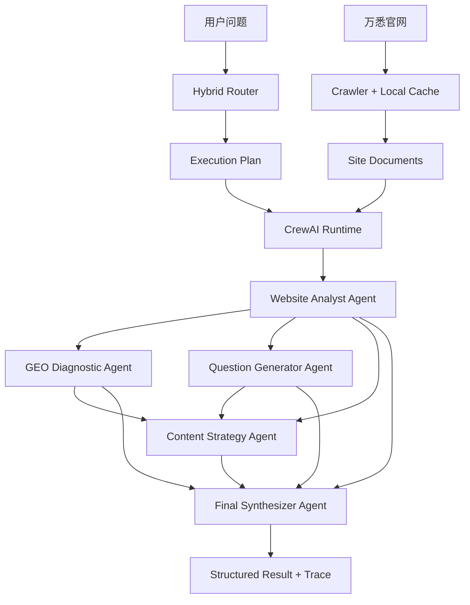

# WANXI Multi-Agent GEO Studio

> 万悉科技 AI 高级工程师笔试 Project 2：基于万悉官网的 GEO 智能体协作系统。

这是一个可本地部署的 **CrewAI Multi-Agent GEO Demo**。系统读取万悉科技官网内容，先由 Hybrid Router 判断用户意图并生成执行计划，再动态创建 CrewAI Agents / Tasks / Crew，执行官网分析、GEO 诊断、用户问题生成、内容策略和最终整合。

## 为什么这样设计

笔试要求的重点不是“写几个 Prompt”，而是：

1. 根据用户问题决定调用哪个 Agent；
2. 复杂问题能够调用多个 Agent；
3. 上游 Agent 的输出真正成为下游 Agent 的输入；
4. 页面能展示 Agent 调用过程和中间结果。

因此本项目采用：

```text
Hybrid Router（显式、可解释）
        ↓
Execution Plan
        ↓
CrewAI Runtime
        ↓
Agent + Task + Task.context
        ↓
Crew(Process.sequential)
        ↓
Final Synthesizer
```

Router 不被 CrewAI 隐藏，便于面试官直接检查调度逻辑；真正的 Agent 定义、任务执行、上下文传递和 Crew 协作由 CrewAI 完成。

## 系统架构



### CrewAI 在项目里具体负责什么

- `Agent`：定义每个 Agent 的 role、goal、backstory、LLM 和 operating prompt。
- `Task`：把本次用户问题和相关网站证据包装成具体任务。
- `Task.context`：显式声明上下游依赖，例如 GEO Diagnostic 使用 Website Analyst 的任务结果。
- `Crew`：把本次 Router 选中的 Agents 和 Tasks 组成一个动态团队。
- `Process.sequential`：按照 Router 生成的依赖顺序执行。
- Final Synthesizer 也是 CrewAI Agent，它消费前面所有选中 Task 的输出并生成最终报告。

## 4 个业务 Agent + 1 个整合 Agent

### Website Analyst

负责从官网证据中提取：

- 品牌定位
- 产品与能力
- 技术关键词
- 服务对象
- 核心表达
- 信息缺口

所有公司事实都要求带 `source_url` 和 evidence。

### GEO Diagnostic

使用 GEO rubric 检查：

- entity clarity
- product clarity
- audience clarity
- problem-solution clarity
- question coverage
- answerability
- evidence density
- semantic consistency
- citation readiness

它评价的是“AI 是否容易理解、抽取和引用”，不会声称能保证排名或被引用。

### Question Generator

基于官网画像模拟目标客户可能在 ChatGPT、DeepSeek、Gemini、Perplexity 中提出的自然问题，并标注：

- persona
- customer stage
- intent
- content needed

### Content Strategy

把官网信息、GEO 诊断和客户问题转成：

- FAQ
- Blog
- Product Page
- Case Study
- Comparison Page

并给出 P0 / P1 / P2 优先级。

### Final Synthesizer

整合所有本次被调用 Agent 的结果，形成最终业务报告，但禁止引入新的公司事实。

## Router 逻辑

Router 使用 **Rule-first + LLM fallback**。

明确意图优先走确定性规则，例如：

```text
“官网表达了什么”
-> website_analyst

“哪些内容适合被 AI 引用”
-> website_analyst
-> geo_diagnostic

“用户可能会怎么问 AI”
-> website_analyst
-> question_generator

“应该写哪些 FAQ / Blog”
-> website_analyst
-> geo_diagnostic
-> content_strategy
```

复杂输入：

```text
请分析万悉科技官网目前哪些内容适合被 AI 引用，
哪些内容还需要优化，
并基于目标客户问题提出内容策略。
```

会形成：

```text
website_analyst
      ├──────────────┐
      ↓              ↓
geo_diagnostic   question_generator
      └──────┬───────┘
             ↓
     content_strategy
             ↓
     final_synthesizer
```

如果规则无法稳定判断，Router 再使用同一个模型做一次轻量 intent classification。

## 网站数据层

系统启动后：

```text
wanxitech.cn
    ↓
requests + BeautifulSoup
    ↓
去除 script / style / nav / footer
    ↓
SiteDocument
    ↓
本地 .cache/site_docs.json
```

后续运行默认复用本地缓存。

为了避免把整个网站全部塞给模型，本项目增加轻量 lexical ranking，根据用户问题挑选相关页面，再构建 Agent context。

这是笔试规模下的工程取舍；生产环境可以把这一层替换为 Elasticsearch / Qdrant / Milvus。

## 本地安装

推荐 Python **3.11 或 3.12**。

### 1. 克隆

```bash
git clone https://github.com/chromiii/WANXI-multiagent.git
cd WANXI-multiagent
```

如果当前正在验证 CrewAI 迁移分支：

```bash
git checkout feature/crewai-orchestration
```

### 2. 创建环境

Windows PowerShell：

```powershell
py -3.11 -m venv .venv
.\.venv\Scripts\Activate.ps1
python -m pip install --upgrade pip
pip install -e .
```

macOS / Linux：

```bash
python3.11 -m venv .venv
source .venv/bin/activate
python -m pip install --upgrade pip
pip install -e .
```

依赖中已经包含 CrewAI：

```text
crewai[openai]>=1.15.17,<1.16
```

## 模型方案 A：Ollama 完全本地

安装 Ollama 后拉取模型：

```bash
ollama pull qwen2.5:7b
```

复制配置：

Windows：

```powershell
Copy-Item .env.example .env
```

macOS / Linux：

```bash
cp .env.example .env
```

默认配置：

```env
LLM_PROVIDER=ollama
LLM_BASE_URL=http://localhost:11434/v1
LLM_MODEL=qwen2.5:7b
LLM_API_KEY=ollama
CREWAI_VERBOSE=false
```

CrewAI 使用其 OpenAI-compatible LLM 接口连接本机 Ollama，所以 Agent 框架在本机运行，模型也可以完全在本机运行。

如果电脑配置不足，可以换更小的 Ollama 模型；如果输出 JSON 不够稳定，建议录 Demo 时使用更强模型或 DeepSeek API。

## 模型方案 B：DeepSeek

修改 `.env`：

```env
LLM_PROVIDER=deepseek
LLM_BASE_URL=https://api.deepseek.com/v1
LLM_MODEL=deepseek-chat
LLM_API_KEY=你的_API_Key
CREWAI_VERBOSE=false
```

不要提交真实 API Key；`.env` 已经在 `.gitignore` 中。

## 启动 Web Demo

```bash
streamlit run app.py
```

默认：

```text
http://localhost:8501
```

页面会展示：

1. Router Decision
2. 被调用的 Agent
3. CrewAI Agent / Task Trace
4. 每个 Agent 的中间 JSON
5. 最终 GEO 报告
6. 官网来源 URL

## CLI

```bash
wanxi-geo "万悉科技官网目前表达了什么？"
```

或者：

```bash
python -m wanxi_geo.cli "请分析万悉科技官网目前哪些内容适合被 AI 引用，并给出 GEO 优化建议。"
```

重新抓取官网：

```bash
wanxi-geo "请生成目标客户可能向 AI 提出的问题" --refresh
```

## 推荐录屏 Case

### Case 1：单业务 Agent

```text
万悉科技官网目前表达了什么？
```

Router：

```text
website_analyst
-> final_synthesizer
```

### Case 2：两个业务 Agent

```text
请基于万悉官网内容，生成一组目标客户可能向 AI 提出的的问题。
```

Router：

```text
website_analyst
-> question_generator
-> final_synthesizer
```

### Case 3：完整协作

```text
请分析万悉科技官网目前哪些内容适合被 AI 引用，
哪些内容还需要优化，
并基于目标客户问题提出内容策略。
```

Router：

```text
website_analyst
├─ geo_diagnostic
├─ question_generator
└─ content_strategy
      ↓
final_synthesizer
```

这个 Case 最适合录屏，因为它能同时展示 Router、多 Agent、Task.context、中间结果和最终整合。

## 幻觉控制

项目使用多层约束：

1. Website Analyst 只能根据抓取的 SITE_CONTEXT 陈述公司事实。
2. 公司事实要求附带 source URL 和 evidence。
3. 缺少证据时返回 `insufficient_evidence` 或 missing information。
4. GEO Diagnostic 明确区分 Observation 和 Recommendation。
5. Content Strategy 可以提出新内容，但必须标成未来建议，不能冒充现有事实。
6. CrewAI Task.context 传递结构化上游输出，减少不同 Agent 重复“猜事实”。
7. Final Synthesizer 只能整合前序任务结果，禁止增加新的公司事实。

## 项目目录

```text
.
├── app.py
├── README.md
├── pyproject.toml
├── requirements.txt
├── .env.example
│
├── src/wanxi_geo/
│   ├── agents/
│   │   ├── base.py
│   │   ├── website_analyst.py
│   │   ├── geo_diagnostic.py
│   │   ├── question_generator.py
│   │   ├── content_strategy.py
│   │   └── synthesizer.py
│   │
│   ├── prompts/
│   │   ├── website_analyst.md
│   │   ├── geo_diagnostic.md
│   │   ├── question_generator.md
│   │   ├── content_strategy.md
│   │   └── synthesizer.md
│   │
│   ├── crawler.py
│   ├── context.py
│   ├── crew_plan.py
│   ├── crewai_runtime.py
│   ├── router.py
│   ├── orchestrator.py
│   ├── llm.py
│   ├── models.py
│   ├── config.py
│   └── cli.py
│
├── tests/
└── examples/
```

## 测试

```bash
pytest -q
```

测试重点：

- 不同自然语言问题是否路由到不同 Agent；
- Content Strategy 是否自动补齐必要上游依赖；
- 复杂查询是否生成四 Agent 执行计划；
- Router 输出是否能正确转换成 CrewAI Task graph；
- 爬虫和轻量检索是否正常工作。

## 为什么没有把 Router 完全交给 CrewAI

这是有意的工程选择。

本题评分标准明确要求“根据用户输入决定调用哪个 Agent”并展示调用逻辑，因此 Router 使用独立、可测试的策略层；Router 输出 Execution Plan 后，CrewAI 负责真正的 Agent/Task/Crew 协作。

这样可以在 Demo 中直接解释：

```text
用户输入
-> 为什么命中这些规则
-> 为什么选择这些 Agent
-> 哪些 Task 依赖哪些 Task
-> CrewAI 如何执行
-> 每个 Agent 输出了什么
```

如果扩展为生产级系统，可以进一步把外层状态和条件分支迁移到 CrewAI Flow。

## 当前不足与后续优化

当前版本是 3 天笔试场景下的工程 Demo，不声称是生产级 GEO 平台。

主要限制：

- JavaScript 重度页面尚未接 Playwright fallback。
- 网站检索目前是 lexical ranking，而不是 embedding / hybrid search。
- GEO rubric 是内容可引用性诊断，不等价于真实 ChatGPT / Gemini / Perplexity 曝光数据。
- 尚未实现线上 citation monitoring。
- 本地小模型的 JSON 遵循能力可能弱于云端大模型。
- Crew 使用 sequential process，以保证 Demo 可解释；后续可以引入并行 Task、hierarchical process 或 CrewAI Flow。
- 连续追问目前只有 Streamlit session history，没有长期 checkpoint / memory。

## 面试时的一句话解释

> 系统先用显式 Hybrid Router 将自然语言问题转换为带依赖关系的 Agent 执行计划，再动态生成 CrewAI Agents 和 Tasks，通过 Task.context 传递上游结果，由 Crew 顺序执行，最后由 Synthesizer Agent 汇总；这样既使用成熟 Multi-Agent 框架，又保留路由逻辑的可解释性和可测试性。
